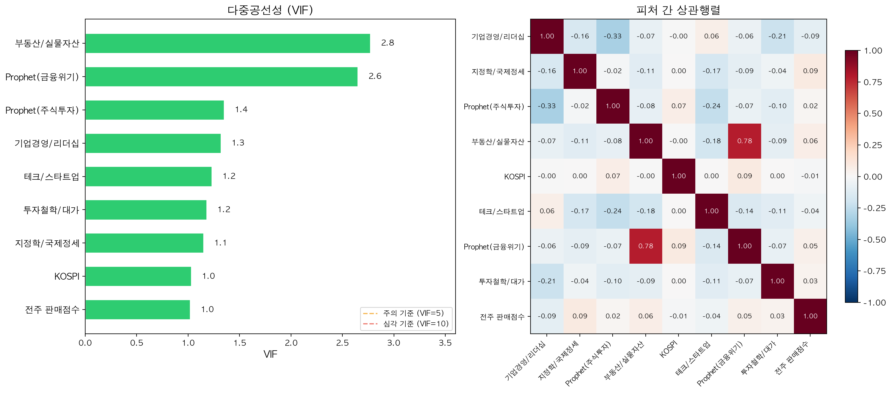
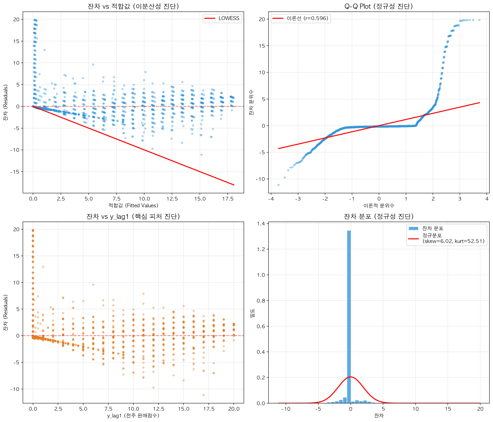
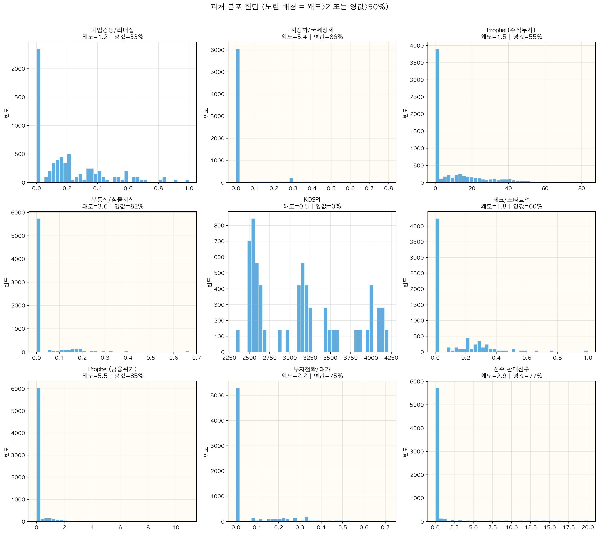

# 피처 통계 진단 결과

> 최종 모델: Feature Selection 8개 + y_lag1 (총 9개 피처)
> 데이터: books_ml_dataset_v4.csv (2025년 1~12월, 141권)

---

## 1. 다중공선성 (VIF)

| 피처 | VIF | 판정 |
|------|-----|------|
| 부동산/실물자산 (category_3) | 2.77 | OK |
| Prophet(금융위기) | 2.65 | OK |
| Prophet(주식투자) | 1.35 | OK |
| 기업경영/리더십 (category_4) | 1.32 | OK |
| 테크/스타트업 (category_9) | 1.23 | OK |
| 투자철학/대가 (category_6) | 1.18 | OK |
| 지정학/국제정세 (category_10) | 1.15 | OK |
| KOSPI | 1.03 | OK |
| 전주 판매점수 (y_lag1) | 1.02 | OK |

- **전체 VIF < 3** → 다중공선성 문제 없음
- 이전 분석(lag1~4)에서 VIF 8.3이었던 문제가 Feature Selection으로 해소됨

**VIF 기준:** < 5 양호 / 5~10 주의 / ≥ 10 심각

---

## 2. 피처 간 상관관계

|r| > 0.3인 피처 쌍:

| 피처 1 | 피처 2 | 상관계수 |
|--------|--------|----------|
| 부동산/실물자산 | Prophet(금융위기) | 0.784 |
| 기업경영/리더십 | Prophet(주식투자) | -0.327 |

- 부동산 × 금융위기: r=0.78로 높은 편이나, **VIF가 각각 2.77, 2.65**이므로 실제 다중공선성 문제는 없음
- 나머지 피처 쌍은 모두 |r| < 0.3 → 독립적

---

## 3. 이분산성 진단

| 검정 | 통계량 | p-value | 판정 |
|------|--------|---------|------|
| Breusch-Pagan | 17.00 | **0.049** | 경계 (약한 이분산성) |
| White Test | 55.87 | **0.404** | 통과 (등분산) |

- Breusch-Pagan이 p=0.049로 경계선에 걸림
- White Test는 통과 → 비선형 이분산성은 없음
- **결론:** 경미한 수준. 트리 기반 모델은 이분산성 가정이 불필요하므로 영향 없음

---

## 4. 잔차 정규성 진단

| 검정 | 통계량 | p-value | 판정 |
|------|--------|---------|------|
| Jarque-Bera | 852,464 | 0.000 | 비정규분포 |

| 지표 | 값 | 해석 |
|------|-----|------|
| 왜도 (Skewness) | 6.02 | 강한 우측 편향 |
| 첨도 (Kurtosis) | 52.51 | 극단적 뾰족 분포 |

- **원인:** 판매점수(y) 자체가 대부분 0 근처이고, 상위 소수만 10~20점 → 극단적 편향 분포
- **영향:** OLS 회귀의 신뢰구간/p-value 해석 시 주의 필요
- **대응:** 트리 모델은 정규성 가정 불필요. RobustScaler로 이상치 영향 완화

---

## 5. 피처 분포 특성

| 피처 | 왜도 | 영값 비율 | 비고 |
|------|------|----------|------|
| 기업경영/리더십 | 1.2 | 33% | 양호 |
| KOSPI | 0.5 | 0% | 양호 |
| Prophet(주식투자) | 1.5 | 55% | 스파스 |
| 테크/스타트업 | 1.8 | 60% | 스파스 |
| 투자철학/대가 | 2.2 | 75% | 스파스 + 왜도 |
| 전주 판매점수 | 2.9 | 77% | 스파스 + 왜도 |
| 지정학/국제정세 | 3.4 | 86% | 스파스 + 왜도 |
| 부동산/실물자산 | 3.6 | 82% | 스파스 + 왜도 |
| Prophet(금융위기) | 5.5 | 85% | 매우 스파스 |

- 9개 피처 중 7개가 영값 비율 50% 이상 → **스파스 데이터**
- RobustScaler 사용 이유: StandardScaler는 이런 분포에서 평균/표준편차가 왜곡됨

---

## 6. 진단 요약

| 항목 | 결과 | 심각도 | 대응 |
|------|------|--------|------|
| 다중공선성 | 전체 VIF < 3 | 없음 | Feature Selection으로 해소 |
| 피처 상관 | 부동산×금융위기 r=0.78 | 낮음 | VIF 양호, 문제 없음 |
| 이분산성 | BP 경계, White 통과 | 경미 | 트리 모델에 영향 없음 |
| 잔차 정규성 | 비정규 (skew=6.0) | 중간 | 트리 모델에 영향 없음 |
| 피처 스파스성 | 7/9 피처 영값 >50% | 중간 | RobustScaler로 대응 |

**최종 판단:** 통계적 문제는 잔차 비정규성과 스파스 분포에 집중되어 있으나, 이는 데이터 자체의 특성(대부분의 책이 0점, 소수만 고점)에서 기인함. 트리 기반 모델 + RobustScaler 조합으로 적절히 대응되어 있음.

---

## 부록: 진단 시각화

### VIF + 상관행렬

### 잔차 진단 4분할

- **좌상단 (Residuals vs Fitted)**: 적합값 커질수록 잔차 범위 확대 → 약한 이분산성 시사
- **우상단 (Q-Q Plot)**: 양 끝 심하게 이탈 → 비정규분포 확인
- **좌하단 (Residuals vs y_lag1)**: y_lag1 커질수록 잔차 범위 확대
- **우하단 (Residual Distribution)**: 0 근처 집중, 우측 긴 꼬리

### 피처 분포

- KOSPI만 정규 분포에 가까움
- 나머지 피처 대부분 영값 중심의 스파스 분포
