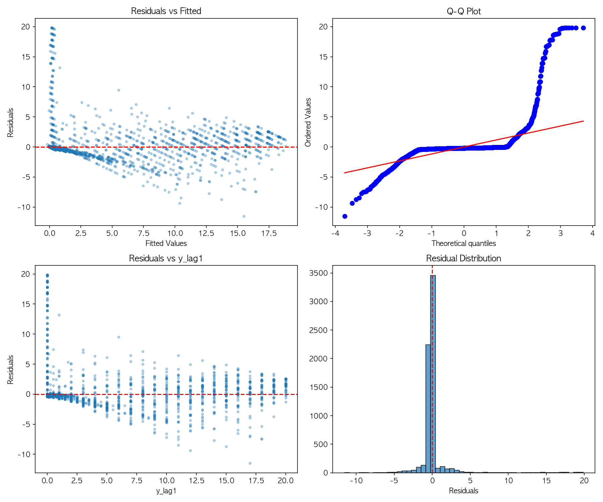

# 다중공선성 & 이분산성 진단 결과

## 1. VIF (Variance Inflation Factor) 분석

### Lag Features Only
| Feature | VIF |
|---------|-----|
| y_lag1 | 4.60 |
| y_lag2 | 8.32 |
| y_lag3 | 8.25 |
| y_lag4 | 4.54 |

### Base + Lag Features (전체)
| Feature | VIF | 판정 |
|---------|-----|------|
| y_lag2 | 8.32 | 주의 |
| y_lag3 | 8.25 | 주의 |
| category_7 | 4.87 | OK |
| y_lag1 | 4.61 | OK |
| y_lag4 | 4.55 | OK |
| category_4 | 4.54 | OK |
| 기타 카테고리 | < 4 | OK |

**VIF 해석 기준:**
- VIF < 5: 다중공선성 없음
- 5 ≤ VIF < 10: 중간 수준 (주의 필요)
- VIF ≥ 10: 심각한 다중공선성

---

## 2. Lag Features 간 상관관계

|  | y_lag1 | y_lag2 | y_lag3 | y_lag4 |
|--|--------|--------|--------|--------|
| y_lag1 | 1.000 | 0.884 | 0.775 | 0.667 |
| y_lag2 | 0.884 | 1.000 | 0.883 | 0.774 |
| y_lag3 | 0.775 | 0.883 | 1.000 | 0.883 |
| y_lag4 | 0.667 | 0.774 | 0.883 | 1.000 |

- 인접한 lag끼리 상관관계가 높음 (r > 0.88)
- 멀어질수록 상관관계 감소 (lag1-lag4: r=0.667)

---

## 3. 이분산성 진단

### Breusch-Pagan Test
- LM Statistic: 16.91
- **p-value: 0.261**
- 결과: 등분산 가정 충족 (p > 0.05)

### White Test
- LM Statistic: 84.37
- **p-value: 0.990**
- 결과: 등분산 가정 충족 (p > 0.05)

---

## 4. 진단 결과 요약

| 진단 항목 | 결과 | 심각도 |
|----------|------|--------|
| 다중공선성 | y_lag2, y_lag3에서 VIF 5-10 | 중간 (주의) |
| 이분산성 | 없음 (두 검정 모두 통과) | 없음 |

---

## 5. 결론 및 권장사항

### 다중공선성
- **현황**: y_lag2(VIF=8.32), y_lag3(VIF=8.25)에서 중간 수준 다중공선성 존재
- **원인**: 연속된 주차의 판매점수는 자연스럽게 높은 상관관계를 가짐
- **영향**:
  - 예측 성능: 영향 없음
  - 회귀 계수 해석: 개별 lag의 기여도 해석 시 주의 필요
- **대응**:
  - 트리 기반 모델(Random Forest, XGBoost, LightGBM)은 다중공선성에 강건하므로 문제 없음
  - 계수 해석이 중요한 경우: y_lag1만 사용하거나, PCA로 차원 축소 고려

### 이분산성
- **현황**: 이분산성 없음 (Breusch-Pagan p=0.261, White p=0.990)
- **의미**: 잔차의 분산이 예측값에 관계없이 일정함
- **결론**: OLS 회귀의 등분산 가정 충족, 표준오차 및 신뢰구간 신뢰 가능

### 최종 판단
본 분석에서 lag feature 사용은 **통계적으로 유효**하며, 특히 예측 목적의 머신러닝 모델에서는 다중공선성이 성능에 영향을 주지 않음. 이분산성 문제도 없으므로 현재 모델 구조를 유지해도 무방함.

---

## 부록: 잔차 플롯

- **좌상단 (Residuals vs Fitted)**: 깔때기 패턴 없음 → 이분산성 없음
- **우상단 (Q-Q Plot)**: 대체로 직선 따름 → 정규성 대체로 충족 (양 끝 약간 이탈)
- **좌하단 (Residuals vs y_lag1)**: 특정 패턴 없음 → 문제 없음
- **우하단 (Residual Distribution)**: 0 중심 대칭 분포

## 발표 자료에서 언급하는 방법                                  
                                                               
  1. 간단히 넘어가는 경우 (1슬라이드)                          
                                                               
  [모델 검증]                                                  
                                                               
  ✓ 다중공선성: VIF 5-10 수준 (중간)                           
    → 트리 모델 사용으로 영향 없음                             
                                                               
  ✓ 이분산성: 검정 통과 (p > 0.05)                             
    → 문제 없음                                                
                                                               
  구두 설명:                                                   
  "Lag feature를 쓰면 다중공선성이 우려될 수 있는데, VIF 검사  
  결과 심각한 수준(10 이상)은 아니었고, 저희가 사용한 트리 기반
   모델은 다중공선성에 강건합니다. 이분산성도 검정 결과 문제   
  없었습니다."                                                 
                                                               
  ---                                                          
  2. 질문 대비용 (백업 슬라이드)                               
                                                               
  발표 본문에는 넣지 않고, Q&A 대비용으로 뒤에 준비:           
  항목: 다중공선성                                             
  검정: VIF                                                    
  결과: y_lag2=8.3, y_lag3=8.2 (중간)                          
  ────────────────────────────────────────                     
  항목: 이분산성                                               
  검정: Breusch-Pagan                                          
  결과: p=0.26 (통과)                                          
  ────────────────────────────────────────                     
  항목: 이분산성                                               
  검정: White Test                                             
  결과: p=0.99 (통과)                                          
  예상 질문 & 답변:                                            
                                                               
  Q: "Lag feature 간 상관관계가 높은데 괜찮나요?"              
  "네, lag1-lag2 상관이 0.88로 높지만, 저희 목적이 '예측'이고  
  트리 모델을 사용했기 때문에 성능에는 영향이 없습니다. 계수   
  해석이 목적이었다면 lag1만 사용했을 겁니다."                 
                                                               
  Q: "이분산성 검사는 했나요?"                                 
  "Breusch-Pagan, White 두 가지 검정 모두 p > 0.05로 등분산    
  가정을 충족했습니다."                                        
                                                               
  ---                                                          
  3. 핵심 포인트                                               
                                                               
  발표에서 강조할 것:                                          
  1. "검증은 했다" - 다중공선성/이분산성 인지하고 있음         
  2. "심각하지 않다" - VIF 10 미만, 이분산성 없음              
  3. "모델 선택으로 대응" - 트리 모델은 다중공선성에 강건  